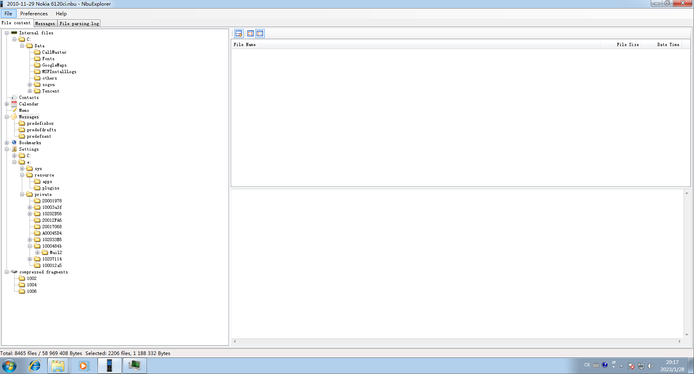

## 注意

发出去的信息没有 `Data`, 并且 `From` 是硬编码 `<not inserted>`  
可以通过 `.\utils\check` 下的 `checkDataEqualFromNotInserted` 方法验证两者完全一致

#### 时间错

-   Python 库里面时区是错的,因此这里手动加 +8

## Tool

#### 查看彩信 ( \*.mms )

### MessagingToolkit.MMS.Demo.exe

一个查看彩信(\*.mms)的 Demo 程序

### Nokia PC Suite

`\\Tool\\Nokia_PC_Suite_ALL_7.1.180.94.exe`

安装 Nokia 套件后也可以直接打开查看, 我使用的版本是 `7.1.180.94`, 不知道是不是最后版本

#### NbuExplorer.exe

可以用来打开 Nokia 备份

